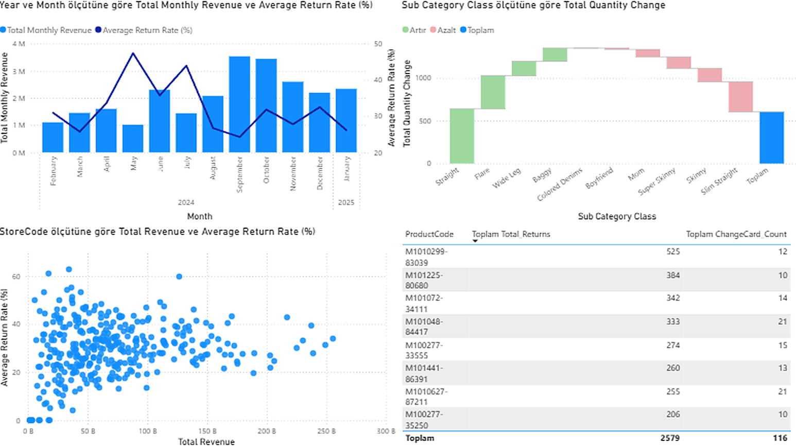
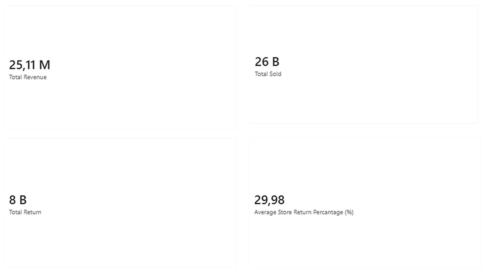

# Mavi Retail Sales and Return Analysis

An end-to-end business intelligence workflow analyzing Mavi denim store sales data using **Python, Excel, and Power BI**. The objective goes beyond standard revenue tracking to identify product-level return trends, discount dependency, category growth patterns, and inflation-adjusted volume growth.

## At a Glance

| Metric | Value |
|---|---|
| Total Revenue | 25.11M TL |
| Units Sold | 26,011 |
| Units Returned | 8,091 |
| Overall Return Rate | 31.1% |
| Period Covered | Feb 2024 – Jan 2025 |
| Stores Analyzed | 350 |
| Products Analyzed | 249 (across 10 denim fits) |

## Dashboard Previews




## Data Processing and Methodology

* Analyzed 34,070 transaction records spanning February 2024 to January 2025, merged with a 1,511-row product catalog on `ProductCode`.
* Validated data quality: no duplicate records found; IQR-based outlier detection on `Amount` flagged 624 rows (2.4%), corresponding to legitimately high-priced items rather than data errors.
* Identified and isolated 15 rows with a positive `Quantity` but a negative `Amount` — a logical inconsistency most likely caused by a discount calculation error rather than a real transaction. These rows were kept in the dataset (to preserve inventory and net revenue accuracy) but flagged separately for transparency.
* Cross-referenced products with high return volumes against high exchange-card (`ChangeCardFlag`) usage to pinpoint potentially problematic items (e.g. sizing inaccuracies or fit defects).
* Calculated category growth using net **units sold** rather than revenue, isolating true consumer demand shifts from inflation and price hikes.
* Exported all processed aggregations into a single, multi-sheet Excel file (Main_Data, Category_Summary, Store_Summary, Monthly_Trend, Category_Growth, Problematic_Products) optimized for Power BI data modeling.

## Key Insights

### Monthly Trend
* **September** — the most commercially healthy month: highest revenue (3.54M TL) and lowest return rate (24.2%), driven by strong organic demand.
* **May** — the weakest month: lowest revenue (1.01M TL) and highest return rate (47.4%) — nearly half of what sold that month came back.
* **July** — highest discount rate (11.3%) despite mid-range sales volume, indicating heavy reliance on markdowns rather than natural demand.
* **Average Order Value (AOV)** climbed steadily from 838 TL (February) to 1,126 TL (January), showing increased spend per transaction regardless of total volume.

### Category Performance
* **Slim Straight** is the most efficient fit: the lowest discount rate (2.4%) combined with a below-average return rate — sells close to full price on organic demand.
* **Boyfriend** and **Colored Denims** show the weakest underlying demand: discount rates of 29.6% and 15.1% respectively against very low sales volume.
* **Straight, Flare, and Wide Leg** posted the strongest real (unit-based) growth from the first quarter to the last quarter of the period; **Skinny** and **Slim Straight** saw the sharpest declines.
* **Mom (38.5%) and Skinny (38.1%)** carry the two highest return rates of any fit. Product-level analysis shows these returns are concentrated in a handful of specific models rather than spread evenly across the category — pointing to a product-specific sizing issue rather than a category-wide fit problem.

### Problem-Product Detection
* Cross-referencing the top 10 products by exchange-card usage against the top 10 most-returned products surfaced **8 products appearing on both lists** — customers who return these items frequently also re-purchase via exchange credit, a strong signal of sizing/fit issues on those specific models (e.g. `M1010299-83039`, `M101072-34111`, `M100277-33555`).

### Store Performance
* Store-level revenue and return rate were compared across all 350 stores, revealing a clear split between high-revenue/low-return "top performer" stores and low-revenue/high-return "at-risk" stores — segmented in the dashboard as a Best / Normal / At-Risk performance group.

## Power BI Dashboard

The processed tables were loaded into an interactive Power BI dashboard including:
* Four KPI cards (Total Revenue, Total Sold, Total Return, Average Store Return Rate)
* A monthly revenue + return rate trend chart (correctly sorted in chronological order across the Feb 2024 – Jan 2025 window)
* A category growth waterfall chart (unit-based)
* A store-level revenue vs. return rate scatter plot
* A problem-product cross-reference table
* An interactive month slicer for filtering all visuals at once

## Project Structure
├── mavi_powerbi.Report/ # Power BI report definition (pages, visuals)
├── mavi_powerbi.SemanticModel/ # Power BI data model (tables, measures, relationships)
├── mavi_powerbi.pbip # Power BI project file — open this in Power BI Desktop
├── mavi_powerbi.pdf # Static PDF export of the dashboard
├── mavi.ipynb # Python data cleaning & analysis notebook
├── graph1.png / graph2.png # Dashboard preview images
└── README.md

## How to Run

**Python notebook:**
```bash
pip install pandas openpyxl
jupyter notebook mavi.ipynb
```

**Power BI dashboard:**
Open `mavi_powerbi.pbip` in [Power BI Desktop](https://powerbi.microsoft.com/desktop/) (free) — this loads both the `.Report` and `.SemanticModel` folders as a single project. No additional configuration needed. A static `mavi_powerbi.pdf` export is also included for a quick preview without opening Power BI.

## Technologies Used

* **Data Preparation:** Python, Pandas, Excel
* **Visualization:** Power BI
* **Version Control:** Git, GitHub Project Structure (.pbip)
